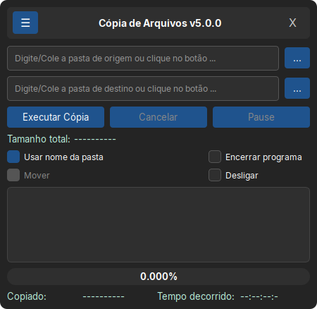

# 📂 Cópia de Arquivos (PyQt6)

Aplicativo desktop moderno e otimizado para cópia de arquivos e diretórios em alta velocidade, projetado para iniciar a cópia **imediatamente** sem travamentos de interface, oferecendo suporte nativo a multithreading e tolerância a falhas em discos danificados.

---

## 📸 Demonstração



*> Interface principal utilizando o menu hambúrguer para acesso rápido aos logs e configurações.*

---

## ✨ Principais Recursos

- ⚡ **Cópia Imediata:** O processo de cópia começa no segundo zero, enquanto a varredura do tamanho total roda em segundo plano.
- 🍔 **Interface Moderna (PyQt6):** Layout responsivo com **Menu Hambúrguer** expansível/retrátil.
- 🎨 **Suporte a Temas:** Alternância de temas e barras de título personalizadas.
- 🧵 **Multithreading Seguro:** A interface não trava durante grandes transferências ou falhas de leitura.
- 📋 **Gerenciador de Logs Integrado:** Visualização, limpeza e registro em tempo real de erros e status.
- ⚙️ **Autodesligamento/Encerramento:** Opção para desligar ou encerrar o sistema após a conclusão.

---

## 📁 Estrutura do Projeto

- `main.py` → Ponto de entrada da aplicação.
- `copiar_arquivos.py` → Motor assíncrono (Worker) para gerenciar a cópia, threads e logs.
- `janela_copiar_arquivos.py` → Interface gráfica principal construída em **PyQt6**.
- `janela_logs.py` → Subjanela para visualização e gerenciamento dos registros de log.
- `barra_titulo.py` e `barra_titulo_subjanela.py` → Controle customizado de barras de título e navegação.
- `estilo.py` e `tema.py` → Estilização CSS/QSS e temas visual da aplicação.
- `funcoes.py` → Funções utilitárias e métodos auxiliares.
- `arquivo_log.py` → Módulo para criação, escrita e limpeza de logs.
- `verificarversao.py` → Verificação de versão e atualizações.
- `CHANGELOG.md` → Histórico de alterações e melhorias da aplicação.
- `main.spec` → Script de configuração para geração de executável via PyInstaller.

---

## 🚀 Como Executar ou Compilar

### 1. Executando via Código Fonte (Python)
Certifique-se de ter o **Python 3.10+** e as dependências instaladas:

```bash
pip install PyQt6
python main.py

```

---

### 2. Gerando o Executável (`PyInstaller`)

Para compilar o projeto em um executável único (Windows/Linux):

```bash
pyinstaller main.spec

```

O executável compilado estará disponível no diretório `dist/`.

---

### 3. Instalação no Linux (`.deb`)

Se você gerou o pacote `.deb` para distribuição:

```bash
sudo dpkg -i copiararquivos.deb
sudo apt-get install -f  # Corrige dependências, se necessário

```
---
## 💾 Downloads (Versão v5.0.0)

| Sistema Operacional | Formato | Link de Download |
| :--- | :--- | :--- |
| **Linux (Debian/Ubuntu)** | `.deb` | [📦 Baixar copiararquivos.deb](https://github.com/YannickFigueira/CopiarArquivos/releases/download/v5.0.0/copiararquivos.deb) |
| **Windows (Portátil)** | `.exe` | [💻 Baixar copiararquivos.exe](https://github.com/YannickFigueira/CopiarArquivos/releases/download/v5.0.0/copiararquivos.exe) |
---

## 📧 Contato

* **Autor:** Yannick de Oliveira Figueira
* **E-mail:** [chronostimeinchain@gmail.com](mailto:chronostimeinchain@gmail.com)
